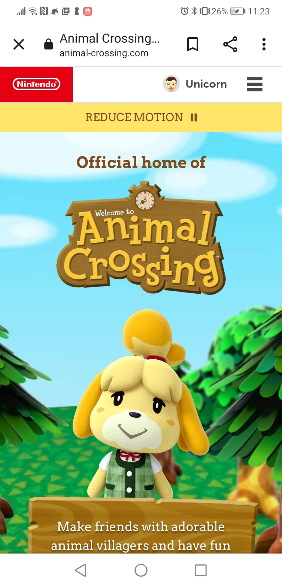
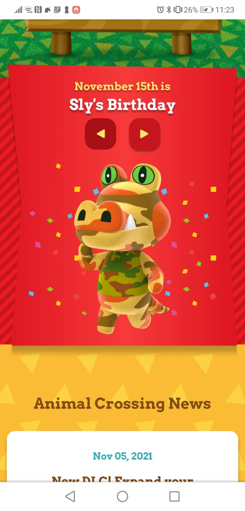
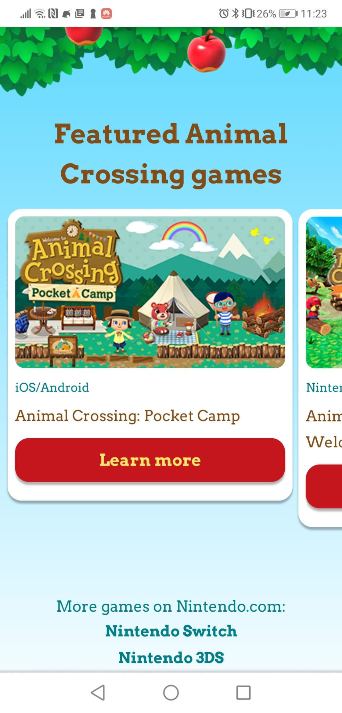
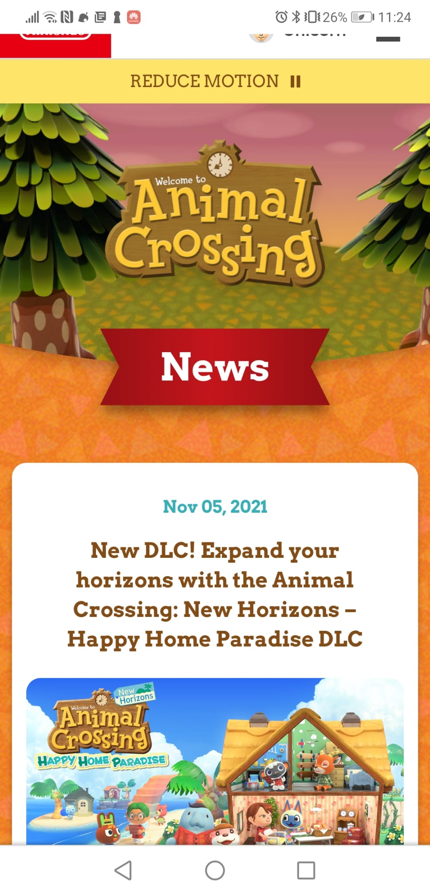
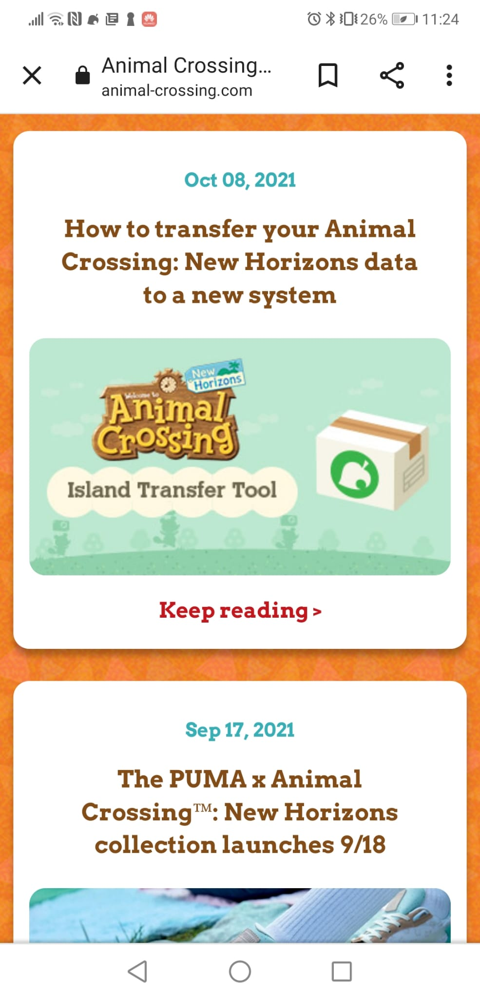
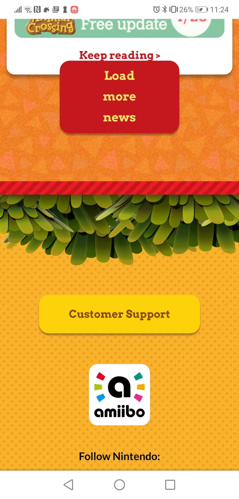
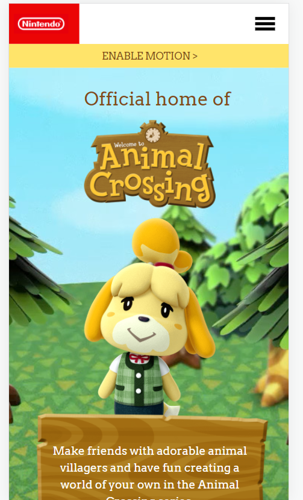
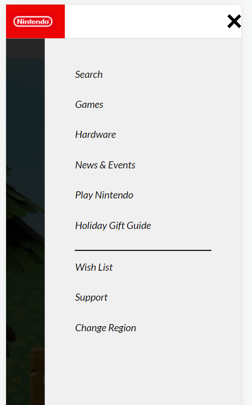
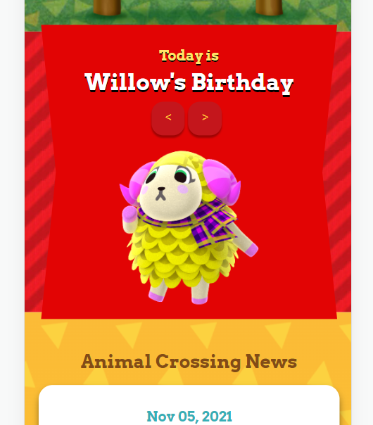

# Procesverslag
Markdown is een simpele manier om HTML te schrijven.  
Markdown cheat cheet: [Hulp bij het schrijven van Markdown](https://github.com/adam-p/markdown-here/wiki/Markdown-Cheatsheet).

Nb. De standaardstructuur en de spartaanse opmaak van de README.md zijn helemaal prima. Het gaat om de inhoud van je procesverslag. Besteedt de tijd voor pracht en praal aan je website.

Nb. Door *open* toe te voegen aan een *details* element kun je deze standaard open zetten. Fijn om dat steeds voor de relevante stuk(ken) te doen.

## Jij

uitwerken voor kick-off werkgroep

### Auteur:
Niels Antonis

#### Je startniveau:
Rood

#### Je focus:
Surface, maar als het me lukt wil ik ook responsive doen.
 

## Je website

uitwerken voor kick-off werkgroep

### Je opdracht:
https://animal-crossing.com/ Mijn favoriete game van de afgelopen paar jaren, interactieve website waar ik mezelf mee hoop uit te dagen.

#### Screenshot(s) van de eerste pagina (small screen): 
Homepage
 

 
#### Screenshot(s) van de tweede pagina (small screen):
Newspage
 

 

## Breakdownschets (week 1)

uitwerken na afloop 2e werkgroep

### de hele pagina: 

### dynamisch deel (bijv menu): 

### wellicht nog een dynamisch deel (bijv filter): 

## Voortgang 1 (week 2)

uitwerken voor 1e voortgang

### Stand van zaken
Ik had moeite met bepaalde zaken goed te ordenen in html, wanneer gebruik ik namelijk een article of een section en wanneer zou ik een divje mogen gebruiken? Verder heb ik de structuur van mijn HTML bijna compleet en kan ik als het goed is beginnen met de eerste stappen in het CSSen van mijn pagina en alles op de juiste plek positioneren.

### Agenda voor meeting
samen met je groepje opstellen

| student 1      | student 2          | student 3    | student 4        |
| ---            | ---                | ---          | ---              |
| Maken van figuren in CSS  | en dit             | en ik dit    | en dan ik dat    |
| Het vinden van achtergrondafbeeldingen | dit als er tijd is | nog een punt | dit wil ik zeker |
| ...            | ...                | ...          | ...              |

### Verslag van meeting

- Ik heb veel DIVjes gebruikt die ik moet aanpassen naar sections
- Beter bijhouden van de GITHUB
- Verder zag mijn HTML er prima uit en kan ik door met het structuren van mijn pagina in CSS

## Voortgang 2 (week 3)

uitwerken voor 2e voortgang

### Stand van zaken
Ik heb de eerste section van mijn pagina goed kunnen vormgeven met css en alles op de juiste plek gekregen voor een mobiel scherm, ik heb echter moeite met het vinden van achtergrond afbleedingen van de pagina. De html structuur van Nintendo is een beetje rommelig waardoor sommige afbeeldingen voor mij onvindbaar zijn. Daarnaast wil ik een zandloper figuurtje maken in css, maar dat lukt me nog niet zo heel lekker.

### Agenda voor meeting
samen met je groepje opstellen

| student 1      | student 2          | student 3    | student 4        |
| ---            | ---                | ---          | ---              |
| dit bespreken  | en dit             | en ik dit    | en dan ik dat    |
| en dat ook nog | dit als er tijd is | nog een punt | dit wil ik zeker |
| ...            | ...                | ...          | ...              |

### Verslag van meeting
hier na afloop snel de uitkomsten van de meeting vastleggen

- Ik heb hulp gekregen bij het zoeken van achtergrondafbeeldingen en kan ze nu zelf vinden in de html structuur van mijn pagina.
- Geleerd om 
- nog een punt
- ...

## Toegankelijkheidstest (week 4)

uitwerken na test in 8e voortgang

### Bevindingen
Lijst met je bevindingen die in de test naar voren kwamen:

#### Titel eerste bevinding
Hier korte omschrijving (met indien nodig een afbeelding)

Hier een omschrijving van hoe het opgelost kan worden (met indien nodig een afbeelding)

#### Titel tweede bevinding. 
Hier korte omschrijving (met indien nodig een afbeelding)

Hier een omschrijving van hoe het opgelost kan worden (met indien nodig een afbeelding)

#### Titel volgende bevinding. 
Hier korte omschrijving (met indien nodig een afbeelding)

Hier een omschrijving van hoe het opgelost kan worden (met indien nodig een afbeelding)

#### Titel nog een bevinding. 
Hier korte omschrijving (met indien nodig een afbeelding)

Hier een omschrijving van hoe het opgelost kan worden (met indien nodig een afbeelding)

## Voortgang 3 (week 4)

uitwerken voor 3e voortgang

### Stand van zaken
hier dit ging goed & dit was lastig (neem ook screenshots op van delen van je website en code)

### Agenda voor meeting
samen met je groepje opstellen

| student 1      | student 2          | student 3    | student 4        |
| ---            | ---                | ---          | ---              |
| dit bespreken  | en dit             | en ik dit    | en dan ik dat    |
| en dat ook nog | dit als er tijd is | nog een punt | dit wil ik zeker |
| ...            | ...                | ...          | ...              |

### Verslag van meeting
hier na afloop snel de uitkomsten van de meeting vastleggen

- punt 1
- punt 2
- nog een punt
- ...

## Eindgesprek (week 5)

uitwerken voor eindgesprek

### Stand van zaken
Het is niet goed gegaan op het einde. Ik heb het idee dat ik alle elementen wel snap, maar dat de website die ik heb gekozen iets te ambitieus was voor mijn huidige situatie. Ik voelde me uiteindelijk overdonderd door alle losse elementen die verschillende stijlingen nodig hebben. Ik heb mijn uiterste best gedaan om zoveel mogelijk nog af te maken, zodat ik morgen nog wel feedback kan krijgen en voor de herkansing beter resultaat kan leveren.

### Screenshot(s)

## Bronnenlijst

continu bijhouden terwijl je werkt

Nb. Wees specifiek ('css-tricks' als bron is bijv. niet specifiek genoeg).

1. bron 1
2. bron 2
3. ...

